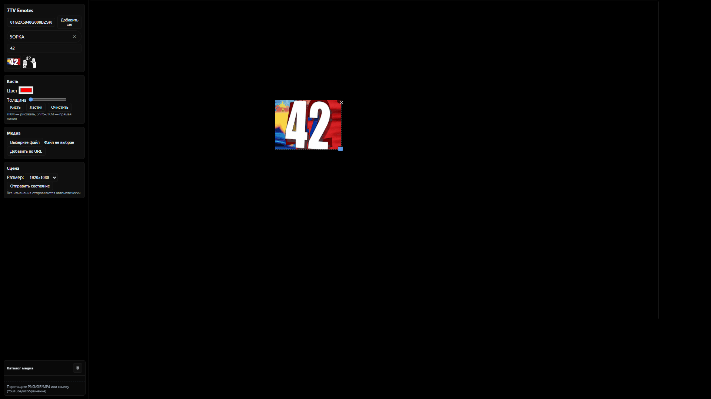

# Live Canvas for streamers (Moderator + Viewer)

A lightweight, no-build web app for live drawing and media overlay, with a moderator page and a green-screen viewer that sync in realtime via SSE.

## Features
- Moderator canvas with brush/eraser, line (Shift), clear
- Drag-and-drop media: PNG, GIF, MP4, direct URLs, YouTube
- 7TV emote sets: load by set ID, search, click-to-add, drag-to-canvas, saved sets
- Local media catalog with thumbnails and persistence
- Drag and resize media boxes; remove via ✕
- Viewer page with chroma green background for OBS
- Dark theme UI

## Quick Start
1. Install Node.js 18+.
2. Start the server:
   ```bash
   cd realtime-canvas
   npm start
   ```
   The server will run on `http://localhost:3001` (or the next free port).
3. Open pages:
   - Moderator: `http://localhost:PORT/mod`
   - Viewer: `http://localhost:PORT/view`

## OBS Setup (Streamer)
- Add a Browser Source pointing to `http://<your-ip>:PORT/view`.
- The viewer has a pure green background; apply chroma key if needed.

## How It Works
- Server: tiny Node HTTP server serving static files and Server-Sent Events (SSE) at `/events`.
- Moderator pushes state with `POST /broadcast`.
- Viewer subscribes to `/events` and applies state.

## Shortcuts
- Draw: Left Mouse Button
- Line: Hold Shift while drawing
- Eraser: Switch tool to Erase

## Screenshots


 


## Directory Structure
```
realtime-canvas/
  public/
    mod.html      # Moderator UI
    view.html     # Viewer (green background)
  server.js       # Static hosting + SSE endpoints
  package.json    # npm start script
  README.md
```

## 7TV Emote Sets
- Paste a 7TV Emote Set ID and press “Добавить сет”.
- Saved sets appear as vertical chips; click to reload, ✕ to remove.
- Search box filters the loaded set.

## Media Catalog
- Bottom-left catalog stores dropped files and URLs (PNG/GIF/MP4/YouTube).
- Click to add to the stage or drag onto the canvas to position.

## Troubleshooting
- Port is busy (EADDRINUSE): server auto-increments to the next port; check the console output.
- Browser blocks autoplay with sound: on the viewer, click once to enable sound for all videos.
- Mixed content: use `http://` for both moderator and viewer when testing locally.

## Notes
- This demo uses in-memory state on the server; restart clears the latest state.
- No authentication or persistence is provided by design.

## License
MIT
